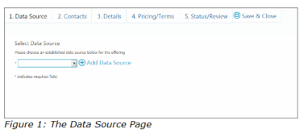
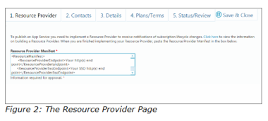
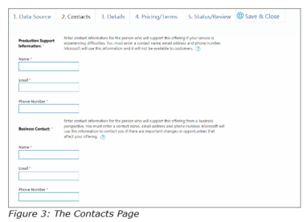
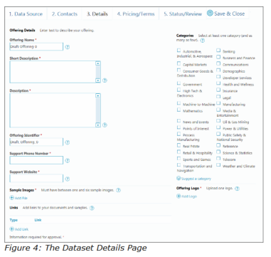
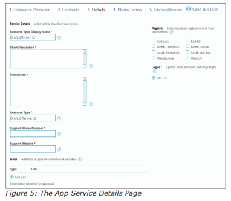
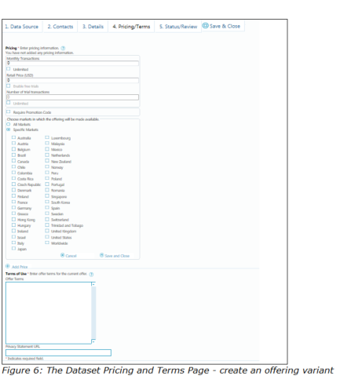
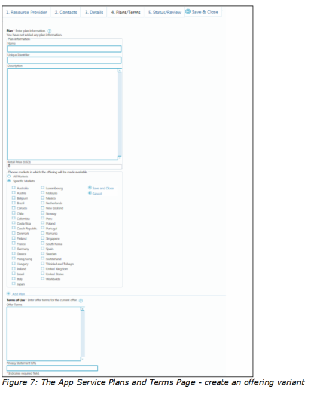
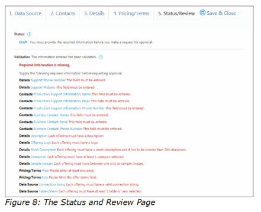

  
<properties 
   pageTitle="Add/Update Your Offerings" 
   description="How to Add or Update Your Offerings" 
   services="cloud-services" 
   documentationCenter="" 
   authors="kevinscharpenberg" 
   manager="manager-alias" 
   editor=""/>

<tags
   ms.service="marketplace"
   ms.devlang="na"
   ms.topic="article"
   ms.tgt_pltfrm="na"
   ms.workload="data-services" 
   ms.date="02/13/2015"
   ms.author="kevsch"/>
#  Add/Update Your Offerings 

 
 -----------

The **Publish** tab is the starting point for adding offerings to the WAM and for updating your existing WAM offerings. When you create an offer you: 

- Make your data or app service available to others.
- Set the conditions or limits as to how your offering can be used.
- Define the costs one incurs for having access to your data or app service.

Currently publishing an app service is by invitation only. If you are interested in publishing an app service, [contact us](mailto:wastorepartners@microsoft.com).

 
 -----------

###Topic Contents

<table>

<td>Section</td><td>Description</td>
</tr>
  <tr>
<td>1) Data Source Page (Data)
</td><td>Provide the data needed for Marketplace to access your data offering.
</td>
</tr>
  <tr>
<td>2) Resource Provider Page (App Service) </td><td>Provide the data needed for Marketplace to access your app service.
</td>
</tr>
  <tr>
<td>3) Contacts Page </td><td>Provide contact information for Microsoft and your customers.
</td>
</tr>  
<tr>
<td>4) Details Page (Data) </td><td>Describe your data offering.
</td>
</tr>  
<tr>
<td>5) Details Page (App Service) </td><td>Describe your app service offering.
</td>
</tr>
  <tr>
<td>6) Pricing/Terms Page (Data) </td><td>Define pricing, terms, and markets for your offering.
</td>
</tr>
  <tr>
<td>7) Pans/Terms Page (App Service) </td><td>Define service plans, terms, and markets for your offering.
</td>
</tr>
  <tr>
<td>8) Status/Review Page </td><td>Review all the information you provided. 
</td>
</tr>
  <tr>
<td>9) Save & Close </td><td>Save any new or changed information and close the page.
</td>
</tr>
  </table>

###Create a New Offering

To create a data offering, click **Add Dataset**. To create an app service offering, click **Add App Service**. Currently publishing an app service is by invitation only.

###1) Data Source Page (Data)
Use the Data Source page to enter the data needed for the Marketplace to connect to your data source. You can choose to either enter database credentials, or contact the Marketplace team about using a Web Service as your data source. 

a) From the dropdown, select the data source for this offering. (Figure 1)  
If the data source you need is not listed:

- Click + **Add Data Source.**

- Click either **Connect to an existing SQL Server or SQL Azure Database** or **Connect to an existing Web Service**.

- Complete the web form.

- Click **Connect**.

b) Select the tables you want to include in this offering. (Figure 1.2)

c) For each table selected, click **Columns** and select the columns from the table to include in this offering.

d) When finished click any of the other tabs - Contacts, Details, Pricing/Terms, Status/Review, or Save & Close. Your work is saved whenever you leave the Data Source page.

###2) Resource Provider Page (App Service)
Use the Resource Provider to provide the endpoints for your service in the format:

	<ResourceManifest>
   	<ResourceProviderEndpoint>Your http(s) end point</ResourceProviderEndpoint> 
  	 <ResourceProviderSsoEndpoint>Your SSO http(s) end point</ResourceProviderSsoEndpoint>
	</ResourceManifest>

a) Enter the Resource Manifest in the text box.

b) When finished click any of the other tabs - Contacts, Details, Plan/Terms, Status/Review, or Save & Close. Your work is saved whenever you leave the Resource Provider page.

###3) Contacts Page
The **Contacts** page is where you provide contact information for your customers and Microsoft.

**Production Support Information**:

- Name

- Email

- Phone Number

**Business Contact**:

- Name

- Email

- Phone Number

###4) Details Page (Data)
The **Details** page is where you describe your data offering.

- **Offering Name**  
The name you give your offering is how it appears in the Marketplace catalog.

- **Short Description**  
A short, 500 characters or less, description of your data offering. This description is indexed and searchable in the WAM. It also appears in search results and on the offering’s Details page.

- **Description** 
A longer, 1,000 characters or less, description of your data offering.

- **Offering Identifier** 
A unique identifier for the offering. The identifier is incorporated in the service URL for this offering and should be unique among your Marketplace offerings. The identifier should be short and contain only uppercase letters (A-Z), lowercase letters (a-z), and numerals (0-9).

- **Support Phone Number** 
The phone number to call when support is needed.

- **Support Website** 
The URL of the support website.

- **Sample Images** 
Between three and six images for the offering’s detail page to help illustrate and explain the offering. The image size must be 720 pixels wide by 540 pixels high. The preferred file format is .png. 

- **Links** 
Links to samples and/or documentation related to your data offering.

- **Catagories** 
One to four categories that best represent your offering. This is used to help consumers find your offering when they search by category.

- **Offering Logo** 
The largest .png version of your logo that fits into a space 200 pixels wide by 150 pixels high. 

###5) Details Page (App Service)
The **Details** page is where you describe your application service offering.

- **Resource Type Name** 
The name you give your offering is how it appears in the Marketplace catalog.

- **Short Description** 
A short, 500 characters or less, description of your data offering. This description is indexed and searchable in the WAM. It also appears in search results and on the offering’s Details page.

- **Description** 
A longer, 1,000 characters or less, description of your data offering.

- **Resource Type** 
A unique identifier that is incorporated in the URL for this offering and its variants. The Resource Type should be short and contain only dot-separated groups of letters, numbers, and underscores. It cannot begin with a number.

- **Support Phone Number** 
The phone number to call when support is needed.

- **Support Website** 
The URL of the support website.

- **Links** 
Links to samples and/or documentation related to your offering.

- **Regions**
One to four categories that best represent your offering.

- **Logos**  
The largest .png version of your logo that fits into a space 200 pixels wide by 150 pixels high. 

###6) Pricing/Terms Page (Data)
Define the pricing, terms, and markets for your offering. Any data offering can have multiple pricing options for the customer to choose from.

To begin creating offer variants, click **Add Price**.

- **Monthly Transactions**  
The number of transactions the customer gets each month they are subscribed at the level. Specify a finite or unlimited number of transactions. 
A transaction is defined as 100 or fewer rows returned by a query.

- **Retail Price**  
The monthly fee a customer pays for access to your data offering.

- **Number of Trial Transactions**  
If you enable trial transactions, customer can freely access your data offering for one month or the specified number of transactions, whichever comes first. A trial subscription automatically becomes a paid subscription after one month unless the customer cancels it before the end of the trial period.

- **Require Promotion Code**  
Indicate whether the purchaser must have a promotion code to subscribe to the offering.

- **Markets**  
Select the global markets where your data offering is made available. Prices are in local currency and calculated from your US dollar rates.

- **Add Price** 
Click **Add Price** to add a pricing variant. You can have multiple variants for any dataset.  
Before you add more pricing variants, click **Save and Close** or you lose the existing values.

- **Terms of use** 
Text that describes the terms under which the subscriber may/may not use the dataset.

- **Privacy Statement URL** 
URL to your privacy statement.

To save your entries for a pricing variant, click **Save and Close** before you leave the page or add another variant.

###7) Plans/Terms Page (App Service)
Define the pricing, terms, and markets for your offering. Any data offering can have multiple pricing options for the customer to choose from.

To begin creating offer variants, click **Add Plan**.

- **Name**  
The name of the offering plan. For example, “Basic.”

- **Unique Identifier** 
An alpha-numeric string that identifies this plan. This identifier is use in API calls.

- **Description** 
The description for this offer. This description, as distinguished from the descriptions on the Details page is for this particular offer variant, such as for the “Basic” offering.

- **Markets** 
Select the global markets where your data offering is made available. Prices are in local currency and calculated from your US dollar rates.

- **Add Plan** 
Click Add Plan to add a pricing variant. You can have multiple variants for any application service.  
Before you add more pricing variants, click **Save and Close** or you lose the existing values.

- **Terms of use** 
Text that describes the terms under which the subscriber may/may not use the application service.

- **Privacy Statement URL** 
URL to your privacy statement.

To save your entries for a pricing variant, click **Save and Close** before you leave the page or add another variant.

###8) Status/Review Page
Review all the information you entered for this data offering. If you find any places that need changes, click the appropriate tab for that information then make the changes.

###9) Save & Close
Whenever you want to save your information so you can return and continue later, click **Save & Close** to save your work and close the page. After you click **Save & Close**, you return to the **Publish** tab.

You do not need to click **Save & Close** when you move from one page to another. The information on the current page is saved before you move to the new page.

 -----------
##See Also

###Concepts  
Publishing Overview  
Register as a Publisher 
Provide payment info 
Create promotional discounts 
Track your sales

