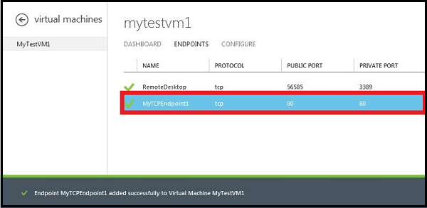
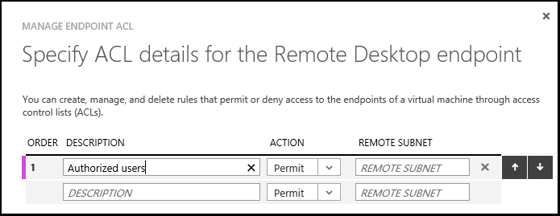

<properties 
	pageTitle="Set up endpoints on a virtual machine in Azure" 
	description="Learn how to setup communication with a virtual machine in Azure." 
	services="virtual-machines" 
	documentationCenter="" 
	authors="KBDAzure" 
	manager="timlt" 
	editor=""/>

<tags 
	ms.service="virtual-machines" 
	ms.workload="infrastructure-services" 
	ms.tgt_pltfrm="na" 
	ms.devlang="na" 
	ms.topic="article" 
	ms.date="02/04/2015" 
	ms.author="kathydav"/>

#How to Set Up Endpoints to a Virtual Machine

All virtual machines that you create in Azure can automatically communicate using a private network channel with other virtual machines in the same cloud service or virtual network. However, other resources on the Internet or other virtual networks require endpoints to handle the inbound network traffic to the virtual machine. 

> [AZURE.NOTE] If you want to connect to your virtual machines directly by hostname or set up cross-premises connections, see [Azure Virtual Network Overview](http://go.microsoft.com/fwlink/p/?LinkID=294063).

When you create a virtual machine in the Management Portal, you can create these endpoints, such as for [Remote Desktop](http://windows.microsoft.com/en-us/windows/connect-using-remote-desktop-connection#connect-using-remote-desktop-connection=windows-7), [Windows PowerShell Remoting](https://technet.microsoft.com/en-us/magazine/ff700227.aspx), or [Secure Shell (SSH)](http://en.wikipedia.org/wiki/Secure_Shell). After you create the virtual machine, you can create additional endpoints as needed. You also can manage incoming traffic to the public port by configuring rules for the [network access control list (ACL)](http://en.wikipedia.org/wiki/Access_control_list) of the endpoint. This article shows you how to do both of those tasks.

Each endpoint has a public port and a private port:

- The private port is used internally by the virtual machine to listen for traffic on that endpoint.

- The public port is used by the Azure load balancer to communicate with the virtual machine from external resources. After you create an endpoint, you can use the network access control list (ACL) to define rules that help isolate and control the incoming traffic on the public port. For more information, see [About Network Access Control Lists](http://go.microsoft.com/fwlink/p/?LinkId=303816).

Default values for the ports and protocol for these endpoints are provided when the endpoints are created through the Management Portal. For all other endpoints, you specify the ports and protocol when you create the endpoint. Resources can connect to an endpoint by using either the TCP or UDP protocol. The TCP protocol includes HTTP, typically port 80, and HTTPS communication, typically port 443.  

**Important**: Firewall configuration is done automatically for ports associated with Remote Desktop and Secure Shell (SSH), and in most cases for Windows PowerShell Remoting during initial Virtual Machine provisioning. For ports specified for all other endpoints, no configuration is done automatically to the firewall in the guest operating system. When you create an endpoint, you'll need to configure the appropriate ports in the firewall to allow the traffic you intend to route through the endpoint.

###Create an Endpoint###

1. If you have not already done so, sign in to the [Azure Management Portal](http://manage.windowsazure.com).

2. Click **Virtual Machines**, and then select the virtual machine that you want to configure.

3. Click **Endpoints**. The Endpoints page lists all endpoints for the virtual machine.

	

4.	Click **Add**.

	The **Add Endpoint** dialog box appears. Choose the type of endpoint. If you're creating a new load-balanced set, choose stand-alone to create the first endpoint in the set.
	
5. In **Name**, type a name for the endpoint.

6. In protocol, specify either **TCP** or **UDP**.

7. In **Public Port** and **Private Port**, type port numbers that you want to use. These port numbers can be different. The public port is the entry point for communication from outside of Azure and is used by the Azure load balancer. You can use the private port and firewall rules on the virtual machine to redirect traffic in a way that is appropriate for your application.

<<<<<<< HEAD
8. Click **Create a load-balancing set** if this endpoint will be the first one in a load-balanced set. Then, on the **Configure the load-balanced set** page, specify a name, protocol, and probe details. Load-balanced sets require a probe so the health of the set can be monitored. For more information, see [Load Balancing Virtual Machines](http://www.windowsazure.com/en-us/manage/windows/common-tasks/how-to-load-balance-virtual-machines/).  
=======
If the virtual machine is in an Azure virtual network, you should use Network Security Groups instead. For more information, see [About Network Security Groups](https://msdn.microsoft.com/library/azure/dn848316.aspx).
>>>>>>> 440cd6ceb9ad667ae1c98784b7b3fe20f52a31f4

9.	Click the check mark to create the endpoint.

	You will now see the endpoint listed on the **Endpoints** page.

	

###Manage the ACL on an Endpoint###

The Access Control List (ACL) on a network endpoint can restrict traffic based upon source IP, to secure the endpoints created on your Virtual Machine. Follow these steps to add, modify, or remove an ACL on an endpoint.

> [AZURE.NOTE] If the endpoint is part of a load-balanced set, any changes you make to the ACL on an endpoint are applied to all endpoints in the set.

1. If you have not already done so, sign in to the [Azure Management Portal](http://manage.windowsazure.com).

2. Click **Virtual Machines**, and then select the virtual machine that you want to configure.

3. Click **Endpoints**. The Endpoints page lists all endpoints for the virtual machine.

<<<<<<< HEAD
    
=======
[Load Balancing Virtual Machines](http://www.windowsazure.com/manage/windows/common-tasks/how-to-load-balance-virtual-machines/)
>>>>>>> 440cd6ceb9ad667ae1c98784b7b3fe20f52a31f4

4. Select the appropriate endpoint from the list. 

5. Click **Manage ACL**.

    The **Specify ACL details** dialog box appears.

    

6. Use rows in the list to add, delete, or edit rules for an ACL. The Remote Subnet value corresponds to the IP address range that you can either allow or deny as a rule. The rules are evaluated in order starting with the first rule and ending with the last rule. This means that rules should be listed from least restrictive to most restrictive. For examples and more information, see [About Network Access Control Lists](http://go.microsoft.com/fwlink/p/?LinkId=303816).
